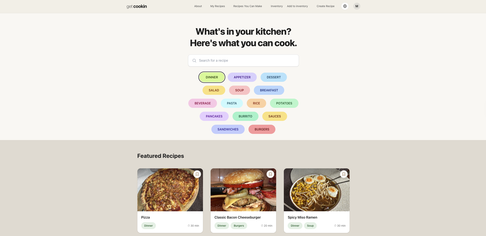
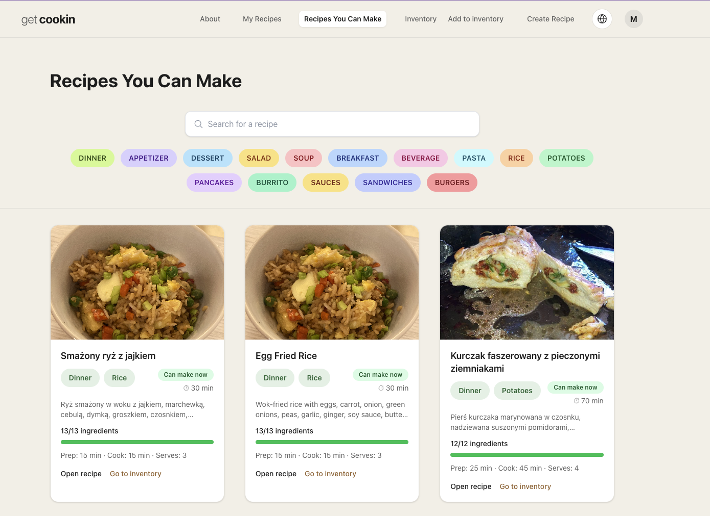
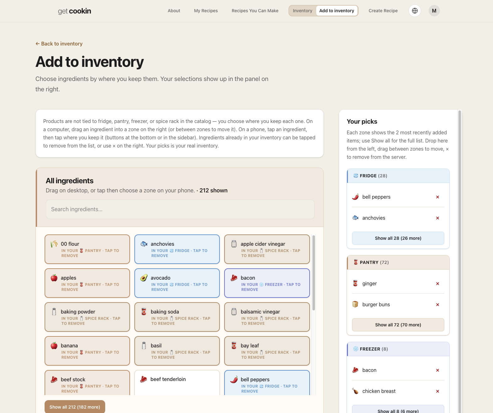

# Get Cookin’ — deployment & platform operations

This repository documents **how Get Cookin’ is deployed and operated**: Kubernetes manifests, Helm charts, observability wiring, and cross-cluster configuration. **Application source and product data** are kept elsewhere (private repos); **this tree is the platform and operations layer.**

*Audience:* a portfolio reference for how this environment is put together (e.g. CV / LinkedIn) — infra and delivery, not the product repo.

## What the product is

Get Cookin’ is a **recipe-management web application**: accounts, inventory, recipe search and editing, and image storage behind an API and a web UI. What follows describes the **Kubernetes and observability setup** that runs that service — not the app codebase or **database contents** (including seeds).

**Live site:** [getcookin.online](https://getcookin.online/)

### Screenshots (production UI)

## How it runs (reality)

The setup this repo describes is **Kubernetes on two physical Macs**, each running its own **kind** cluster:

| Machine | Cluster (typical) | Role |
|--------|-------------------|------|
| **App Mac** | `kind-get-cookin` | The **Get Cookin’** Helm release: Ingress, frontend, API, Postgres, Redis, MinIO — what users hit on the live site. |
| **Monitoring Mac** | `kind-monitoring` | **Observability and alerting**: e.g. kube-prometheus-stack (Grafana / Prometheus), Elasticsearch / Kibana, **Zabbix server**, plus the “receiving” side for logs and remote metrics. |

The two hosts reach each other over a **private network** (e.g. **Tailscale**). The app cluster exposes **Ingress on :80** so the monitoring cluster can **scrape** exporters and service metrics over HTTP; **Fluentd** on the app side ships container logs to Elasticsearch on the monitoring side; **Zabbix agents** on the app cluster talk to the Zabbix server (e.g. trapper **TCP 10051**) on the monitoring side. Details and ports live in `k8s/` (see `k8s/monitoring.secret.env.example`, `k8s/helm/monitoring/values-remote-scrape-server.template.yaml`, `k8s/zabbix/`, `k8s/logging*`).

### Two Macs, two clusters (who talks to whom)

[`k8s/diagrams/two-mac-topology.png`](k8s/diagrams/two-mac-topology.png) · source: [`k8s/diagrams/two-mac-topology.mmd`](k8s/diagrams/two-mac-topology.mmd)

### Inside the app cluster (`k8s/helm/get-cookin`)

Ingress fronts the **frontend** and **API**; the API uses **PostgreSQL**, **Redis**, and **MinIO**. Secrets are applied at deploy time and are not committed in real form.

[`k8s/diagrams/core-platform.png`](k8s/diagrams/core-platform.png) · [`k8s/diagrams/core-platform.mmd`](k8s/diagrams/core-platform.mmd)

**Paths:** UI on `/`; `/api` and `/images` to the API on the same host (Ingress rules in the chart).

### Repository layout

The **application** Helm chart is under `k8s/helm/get-cookin/`. **Monitoring, logging, and Zabbix** live in other `k8s/` paths — that mirrors deployment: app stack vs observability stack, with scrape and agents connecting the two. The diagram below is that **split in the repo**, in one view.

[`k8s/diagrams/optional-layers.png`](k8s/diagrams/optional-layers.png) · [`k8s/diagrams/optional-layers.mmd`](k8s/diagrams/optional-layers.mmd)

## What you will find here

| Area | Role |
|------|------|
| `k8s/helm/get-cookin/` | Main application release: deployments, services, ingress, config snippets |
| `k8s/helm/monitoring/` | kube-prometheus-stack-style values; remote scrape config for the app cluster |
| `k8s/logging*` , `k8s/monitoring*` | Fluentd, Elasticsearch/Kibana, scrape ingress / exporters |
| `k8s/zabbix/` | Zabbix Helm values, agents, automation |
| `.github/workflows/` | Placeholder workflow (Docker build **disabled** here — no app build context in this repo; see workflow file) |
| `docker-compose.yaml` | Legacy / reference multi-service compose (not the primary live path described above) |

Example and template files (e.g. `*.example`, `*.template`) show **shape only**; real env files and overrides stay local and are listed in `.gitignore`.

## What this README is not

- **Not** a tutorial to clone, seed, or run the full application end-to-end from this public tree.
- **Not** a source dump for the UI, API implementation, or recipe/catalog data.
- **Not** an offer of support or a guarantee that these files match any particular private revision.

For permission to use or redistribute material beyond browsing this repository, see [LICENSE](LICENSE).
